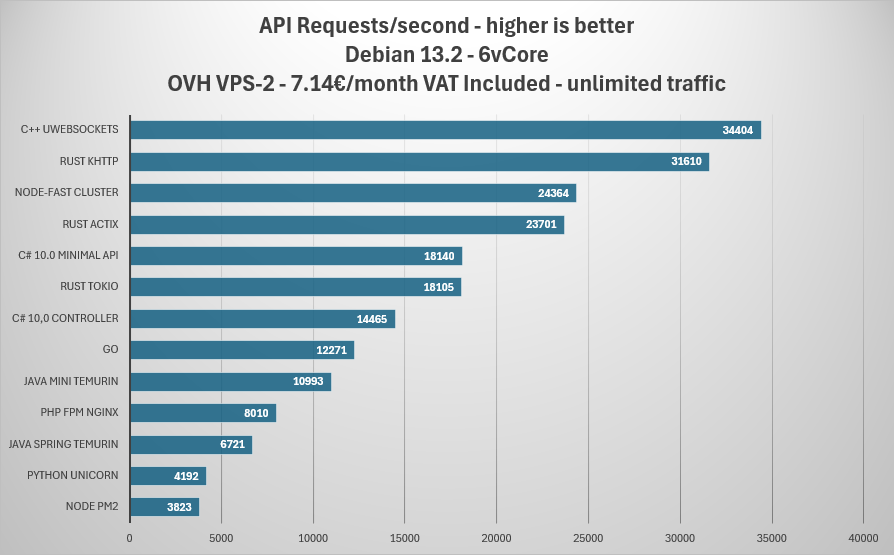
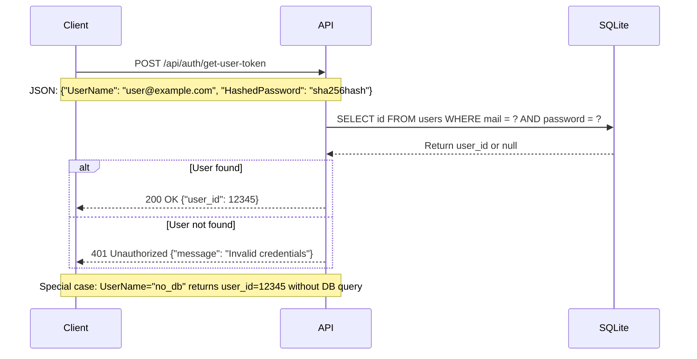

# Which Programming Language Delivers the Fastest API Performance?

There are plenty of benchmarks on the web. I wanted to have some metrics about a simple API performing a database query to see real-world performance. This is I/O metrics, not CPU metrics.

This project is also a good way to compare different programming languages, runtimes, and frameworks.

## Project Big Picture

Each implementation is a simple API that receives a POST request with a username and hashed password, queries a SQLite database to find the user ID, and returns the user ID in the response.

I tried to get maximum performance for each implementation, using best practices and optimized libraries.

## Tested Implementations
| Dev platform            | req/s  | Remarks                                                                                      |
|-------------------------|--------|----------------------------------------------------------------------------------------------|
| node PM2                | 3823   | Pure Node.js performance with a few C++ libraries behind                                     |
| python unicorn          | 4192   | Pure Python, no special optimizations                                                        |
| Java Spring Temurin     | 6721   | Java VM is very sensitive. With some VMs I got 100 req/s. pom files are complex              |
| php fpm nginx           | 8010   | Needs Apache or Nginx                                                                        |
| Java mini Temurin       | 10993  | Java VM is very sensitive. With some VMs I got 100 req/s. pom files are complex              |
| go                      | 12271  | Easy to build, big exe                                                                       |
| C# 10.0 controller      | 14465  | The best compromise for code simplicity, maintenance, and performance                        |
| rust tokio              | 18105  | Easy to build, big exe                                                                       |
| C# 10.0 minimal API     | 18140  | As simple as Python                                                                          |
| rust actix              | 23701  | Easy to build, big exe                                                                       |
| node-fast cluster       | 24364  | Rely on uWebSockets C++ lib                                                                  |
| rust khttp              | 31610  | Easy to build, big exe                                                                       |
| C++ uWebSockets         | 34404  | uWebSockets library makes it possible. Without it, very difficult to get good performance    |


## Take Care About the Processor, Operating System, and Docker

The processor and the OS are key factors regarding performance. I did some tests on an old Intel i5 I have at home, same Debian version but very different results.
- C++ and Node.js get almost the same results
- Java gets as low as 100 reqs/second, don't know why and didn't find how to improve it.

There is a good chance Java uses Processor Extensions like MMX, SSE, or AVX.

I also got different results with Debian 12 and 13. And very different ranking under Windows.

Docker is a performance killer, especially with Java.

## Conclusions

Good performance requires both optimized libraries, most of the time written in C, and a fast runtime. Find some platform pros and cons below and a reflection about monolithic architecture.




**C++ is the fastest**
No surprise here. I'm a senior C++ developer and wouldn't achieve this performance by myself.
The uWebSockets library made the difference.
C++ is not the dev platform I would recommend for APIs; Node.js or C# are better options.

**Node.js with uWebSockets library**
Node.js is making an impressive comeback thanks to the expertise of [David Grelaud](https://www.linkedin.com/in/david-grelaud-247974b/).  
This can be explained by the fact that two C++ libraries are being used directly from the JavaScript code: uWebSockets.js, which is based on the C++ uWebSockets library, and the same goes for SQLite. The JavaScript code simply acts as a relay to the C++ code — and it works remarkably well.

**Rust**  
Rust shows impressive performance, especially with the khttp implementation reaching 31,610 req/s. The performance varies significantly between frameworks (tokio, actix, khttp), demonstrating that the choice of HTTP library matters greatly. If one day some Rust developer does the same socket implementation as we have in uWebSockets, the performance could improve even further.

**dotnet C#**
This is the platform I recommend for large projects that need performance.
The big advantage of C# is that it runs everywhere. One codebase to target almost all devices.

**Java**
The big problem with Java is the JVM you use and how it behaves on the hardware you use.
This is also a little bit more complex to use than C# or JavaScript. Creating a good pom.xml file requires good expertise. Build time is one of the slowest.

**Go**
A good option that creates a single binary.

**PHP**
The deployment is quite complex and you can spend a lot of time figuring out why it doesn't work. Performance is not good.

**Python**
Don't use it if you need performance. You can use it in microservices with a front end in another technology. Deployment is also sometimes problematic if you need to mix versions.

If you need Python for AI, then go for [https://aspire.dev](https://aspire.dev). C# backbone with Python workers.

## Monoprocess vs Multiprocess
Monoprocess has a good advantage regarding sharing or caching information. You don't need Redis to cache information between threads. This is a performance and price advantage.
- Monoprocess: C++, Rust, Java, C#, Go
- Multiprocess: Node.js, PHP, Python

## API Flow



# You Want to Improve?

This project is open to any improvement. Please fork and create a pull request in a new branch.

You should keep the same API, same database (SQLite), same data (10000 users). I'll run the tests on the same hardware.

Please test the current version on your machine and compare your improvement. Please commit only if you get significantly better performance.

# License

This project is for educational and benchmarking purposes.

# Limits

Client and server are on the same machine, so network latency is not taken into account. Also, when a server is very fast, the client uses half of the CPU to send requests. This is an unfair advantage for slow servers.

# Log

```
20260103 - ErwanLegrand - optimise rust db
20251207 - dgrelaud - nodejs-fast version using C++ library uWebSockets.js and better-sqlite3 putting node.js near Rust performance.
20251102 - SebDeLille - Proposal to improve rust-actix, gain 5700 req/s
20251102 - Kuurama - C# class to record to gain 1000 req/s 
```