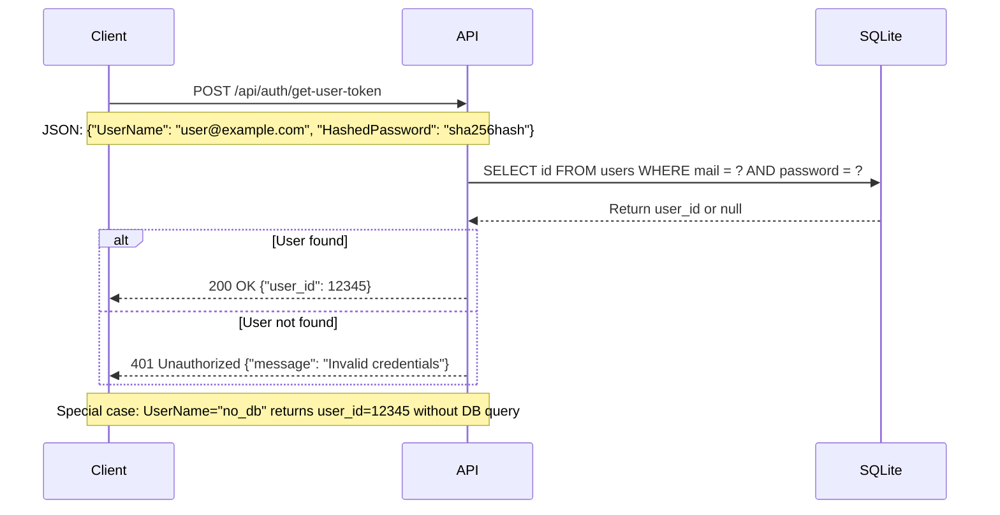

# Which Programming Language Delivers the Fastest API Performance?

There is plenty of benchmarks on the web. I wanted to have some metrics about a simple API doing a database query to see real world performance. This is I/O metrics, not CPU metrics.

This project is also a good way to compare different programming languages, runtimes, and frameworks.

I will compare monolithic vs microservices architecture and show that monolithic is often faster and simpler to maintain and deploy.

## Project big picture

Each implementation is a simple API that receives a POST request with a username and hashed password, queries a SQLite database to find the user ID, and returns the user ID in the response.

I tried to get maximum performance for each implementation, using best practices and optimized libraries.

## Tested Implementations
| Dev platform            | req/s  | Remarks                                                                                      |
|-------------------------|--------|----------------------------------------------------------------------------------------------|
| node PM2                | 3823   | Pure node performance with few C++ lib behind                                                |
| python unicorn          | 4192   | Pure Python, no special optimisations                                                        |
| Java Spring Temurin     | 6721   | Java VM is very sensitive. With some VM I got 100 req/s. pom file are complex                |
| php fpm nginx           | 8010   | Need Apache or Nginx                                                                         |
| Java mini Temurin       | 10993  | Java VM is very sensitive. With some VM I got 100 req/s. pom file are complex                |
| go                      | 12271  | Easy to build, big exe                                                                       |
| C# 10.0 controller      | 14465  | The best compromise for code simplicity, maintenance, and performance                        |
| rust tokio              | 17910  | Easy to build, big exe                                                                       |
| C# 10.0 minimal API     | 18140  | As simple as Python                                                                          |
| rust actix              | 23701  | Easy to build, big exe                                                                       |
| node-fast cluster       | 24364  | Rely on uWebSockets C++ lib                                                                  |
| C++ uWebSockets         | 34404  | uWebSockets library make it possible. Without it very difficult to get good performances     |

## Conclusions

Good performance is both optimized library, most of the time written in C and a fast runtime.


**Rust is 9.8x faster than Node.js.**  
I agree, Rust is not the simplest programming language.

**C# is 7.5x faster than Node.js**, and .NET is very accessible.

I ran all these tests after seeing so many job offers claiming "building a top team to deliver super performant APIs with Python or Node.js".

**Please stop that. This is not true.** Saying that is like running a decathlon with stones in your shoes.

I also spent some time comparing different JVMs, both in Docker and without Docker.

**Comparing Java Native vs Java in Docker => You lose a lot of performance using Docker.**

**Be smart, choose the right stack, and please stop using Python and Node.js for APIs!**

You will save time, achieve better performance, and keep your team happy.

If you need Python for AI, then go for [https://aspire.dev](https://aspire.dev). C# backbone with Python workers.

**Machine:** [OVHcloud](https://ovhcloud.com) VPS-2, 6 vCore, 12 GB RAM, unlimited traffic for 7€/month tax included.

**Discution** on [LinkedIn](https://www.linkedin.com/posts/remi-thomas-fr_which-programming-language-delivers-the-fastest-activity-7390097194038763520-NhfN?utm_source=share&utm_medium=member_desktop&rcm=ACoAABjxEQ4BQrLcBafmBr6SUljEDYOCSO15Zs0)


---

## About This Project

In this repository you will find simple implementations of a UserToken API in multiple programming languages.

The objective is to get the fastest response for each technology.

We can get better performance by optimizing the code, or choosing the right runtime. 

For Java minimal API is faster than Spring Boot.

For Typescript or Javascript, Bun is faster than Node.js. Bun sqlite implementation is really optimized.

## API Flow



# Test client

A test client is provided in C# .NET 9 in directory dotnet_test. Look at readme.md in this directory for instructions.

# Check if everything is working

To be sure api calls are real I added some trace in the console that display userId to be sure we get a real userId from the database.

# You want to improve ?

This project is open to any improvement, please fork and create a pull request.

You should keep the same API, same database (sqlite), same data (10000 users) and same test procedure (100000 requests, 16 concurrent clients).

Please test on your machine the current version and compare your improvement. Please commmit only if you get really better performance.

Result below is from my machine under Windows 10, AMD Ryzen 7 2700X, 32GB RAM, SSD NVMe.

I keep the best result after 5 runs.

**On Windows 10**


# Conclusion

The Debian tests are the most interresting because we do not put production on Windows 10. 

**We can observe a real difference between the two platforms.**
Results are more expected on Debian.

I didn't tried C++ on Debian because C++ is too complex today to start a new project and it's very tricky and time consuming to obtain good results.

# License

This project is for educational and benchmarking purposes.

# Limits

Client and server are on the same machine, so network latency is not taken into account. Also when a server is very fast, the client use half of the CPU to send requests. This is an unfair advantage for slow servers.

# Log

```
20251207 - dgrelaud - nodejs-fast version using C++ library uWebSockets.js and better-sqlite3 putting node.js near Rust performance.
20251102 - SebDeLille - Proposal to improve rust-actix, gain 5700 req/s
20251102 - Kuurama - C# class to record to gain 1000 req/s 
```
