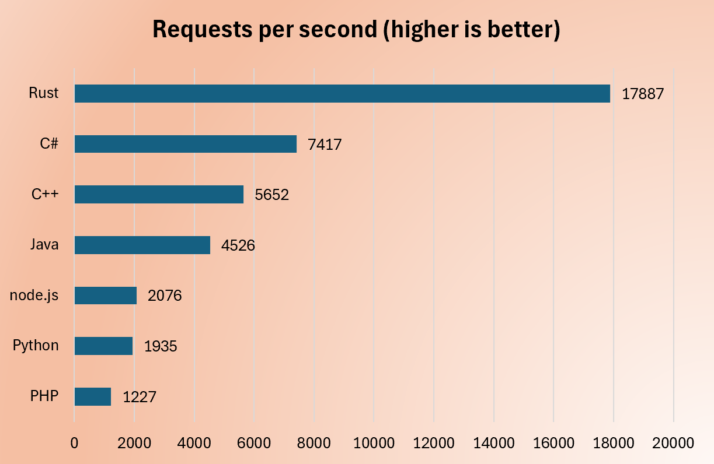

# Multi Dev Language User Token API Comparison

**August the 9th, 2025**

This repository contains eight identical user authentication APIs implemented in different programming languages, along with comprehensive performance testing tools. The project demonstrates performance characteristics across C# .NET Core, Node.js, Rust, PHP, Python, Java, C++, and Go implementations. Additionally, there are minimal variants for .NET and Java (javamini) to compare lean hosting models.

# Context

This test have been created for two main purposes:
1. **Performance Benchmarking**: To compare the performance of different programming languages and frameworks in the context of simple API call and database interaction.
**We do not evaluate complex compute scenarios**.
2. **Code readability and maintainability**: To compare the code readability and maintainability across multiple languages.

All have been build with AI Claude Sonnet 4, reveiwed and improved by human developers.
Note : Claude Sonnet 4 didn't succeed to build the C++ API, I had to fix it manually.
Note 2 : Today choosing C++ for API development is not a good idea. I did it to compare with Rust, which is the "new" C++.

## 📊 Performance Benchmarks

Based on testing with 100,000 requests and 16 concurrent connections
On an AMD Ryzen 7 2700X, 8 core, 16 logical threads - Windows 10 machine.

```
PHP (CGI) 2072 req/s
Node.js 2382 req/s
Java 3235 req/s
Java Minimal API 3805 req/s
Python 4564 req/s
C++ (*) 5920 req/s
C# - Controller 6508 req/s
C# - Minimal API 7401 req/s
Go 12694 req/s
Rust 18563 req/s
```



=> Conclusion : Today if you need performance don't use interpreted code.

Python, node.js and PHP have all been tested with 16 concurrent client and Nginx front.

## 🔍 Performance Analysis

### 🥇 Top Performers (Compiled Languages)
- **Rust**: Compiled to native code with zero-cost abstractions - **fastest overall**
- **Go**: Compiled to native code with efficient runtime and goroutines - **excellent balance of performance and simplicity**
- **C#/.NET Core**: Compiled to native code with managed runtime - **strong enterprise performance**

### 🥈 Mid-Tier Performance
- **C++**: Native compilation with minimal overhead, but **not recommended for API development**
  - *Note*: Difficult and verbose for poor HTTP performance. Better to use a C++ wrapper from Rust, Go or C#.
  - *Today's choice*: Rust is the superior "new C++" for systems programming
- **Java**: JVM with JIT compilation - **good performance through runtime optimizations**

### 🥉 Interpreted/Dynamic Languages
- **Node.js**: V8 JavaScript engine - **decent async performance**
- **Python**: FastAPI/Uvicorn shows **good async capabilities** despite being interpreted
- **PHP**: Traditional interpreted approach - **adequate for standard web apps** (here we don't use PHP-FPM because the test plaform is Windows, not Linux)

## 📝 License

This project is for educational and benchmarking purposes.

## 🔧 Quick Start (selected)

### Java API
```bash
cd java
mvn spring-boot:run
# Runs on http://localhost:6000
```

### Java Minimal API (javamini)
```bash
cd javamini
mvn -q -DskipTests package
java -jar target/javamini-1.0.0-shaded.jar
# Runs on http://localhost:6060
```
