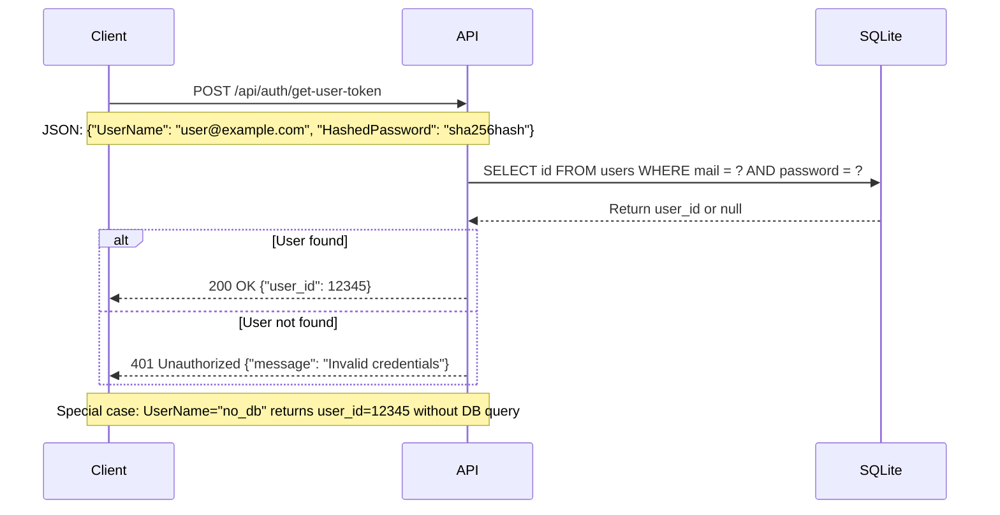

# Which Programming Language Delivers the Fastest API Performance?

There is plenty of benchmarks on the web. I wanted to have some metrics about a simple API doing a database query to see real world performance. This is I/O metrics, not CPU metrics.

This project is also a good way to compare different programming languages, runtimes, and frameworks.

I will compare monolithic vs microservices architecture and show that monolithic is often faster and simpler to maintain and deploy.

## Project big picture

Each implementation is a simple API that receives a POST request with a username and hashed password, queries a SQLite database to find the user ID, and returns the user ID in the response.

I tried to get maximum performance for each implementation, using best practices and optimized libraries.

## Tested Implementations
| Dev platform            | req/s  | Remarks                                                                                      |
|-------------------------|--------|----------------------------------------------------------------------------------------------|
| node PM2                | 3823   | Pure node performance with few C++ lib behind                                                |
| python unicorn          | 4192   | Pure Python, no special optimisations                                                        |
| Java Spring Temurin     | 6721   | Java VM is very sensitive. With some VM I got 100 req/s. pom file are complex                |
| php fpm nginx           | 8010   | Need Apache or Nginx                                                                         |
| Java mini Temurin       | 10993  | Java VM is very sensitive. With some VM I got 100 req/s. pom file are complex                |
| go                      | 12271  | Easy to build, big exe                                                                       |
| C# 10.0 controller      | 14465  | The best compromise for code simplicity, maintenance, and performance                        |
| rust tokio              | 17910  | Easy to build, big exe                                                                       |
| C# 10.0 minimal API     | 18140  | As simple as Python                                                                          |
| rust actix              | 23701  | Easy to build, big exe                                                                       |
| node-fast cluster       | 24364  | Rely on uWebSockets C++ lib                                                                  |
| C++ uWebSockets         | 34404  | uWebSockets library make it possible. Without it very difficult to get good performances     |

## Take care about the processor, the operating system and Docker

The processor and the OS are key factors about performances. I did some test on an old Intel i5 I have at home, same Debian version but very different results.
- C++ and Node.js get almost the same results
- Java get as low as 100 reqs/second, don't know why and didn't find how to improve it.

There is good chances Java use Processor Extensions like MMX, SSE or AVX.

I also got diffrent results with Debian 12 and 13. And very different ranking under Windows.

Docker is a performance killer, specialy with Java.

## Conclusions

Good performance is both optimized library, most of the time written in C and a fast runtime. Find some platform pros and cons bellow and a reflexion about monolithic.


**C++ is the fastest**
No surprise here. I'm a senior C++ dev and wouldn't achieve these performances by myself.
uWebSockets library did the game.
C++ is not the dev platform I would recommand for API, Node or C# are better options.

**Node.js with uWebSockets library**
Node.js is making an impressive comeback thanks to the expertise of [David Grelaud](https://www.linkedin.com/in/david-grelaud-247974b/).  
This can be explained by the fact that two C++ libraries are being used directly from the JavaScript code: uWebSockets.js, which is based on the C++ uWebSockets library, and the same goes for SQLite. The JavaScript code simply acts as a relay to the C++ code — and it works remarkably well.

**Rust**  
It was a surprise to see these bad performances with Rust. If one day some Rust dev
do the same socket implementation as we have in uWebSockets the performances will rise.

**dotnet C#**
This is the platform I advise to use for big projects that need performances.
The big advantage about C# is it runs everywhere. One code to target almost all devices.

**Java**
The big problem with Java is the JVM you use and how it behave on the hardware you use.
This is also a little bit more complex to use than C# or Javascript. Create a good pom.xml file need a good expertise. Build time is one of the slower.

**Go**
A good option that create one binary.

**PHP**
The deployment is quite complex and you can spend a lot of time to find why it doesn't work. Performance is not good.

**Python**
Don't use it if you need performance. You can use it in microservices with a front in another technoloy. Deployment is also sometime problematic if you need to mix versions.

If you need Python for AI, then go for [https://aspire.dev](https://aspire.dev). C# backbone with Python workers.

## Monoprocess vs Multiprocess
Monoprocess have a good advantage about sharing or caching infos. You don't need Redis to cache informations between threads. This is performance and price advantage.
- Monoprocess are C++, Rust, Java, C#, Go
- Multi process are Node, Php, Python

## API Flow



# You want to improve ?

This project is open to any improvement, please fork and create a pull request in a new branch.

You should keep the same API, same database (sqlite), same data (10000 users). I'll run the tests on the same hardware.

Please test on your machine the current version and compare your improvement. Please commmit only if you get really better performance.

# License

This project is for educational and benchmarking purposes.

# Limits

Client and server are on the same machine, so network latency is not taken into account. Also when a server is very fast, the client use half of the CPU to send requests. This is an unfair advantage for slow servers.

# Log

```
20251207 - dgrelaud - nodejs-fast version using C++ library uWebSockets.js and better-sqlite3 putting node.js near Rust performance.
20251102 - SebDeLille - Proposal to improve rust-actix, gain 5700 req/s
20251102 - Kuurama - C# class to record to gain 1000 req/s 
```
